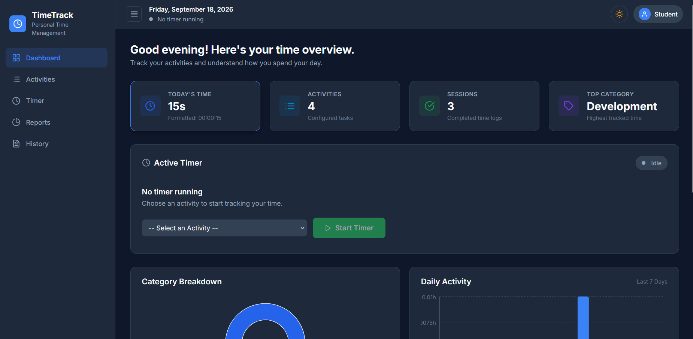
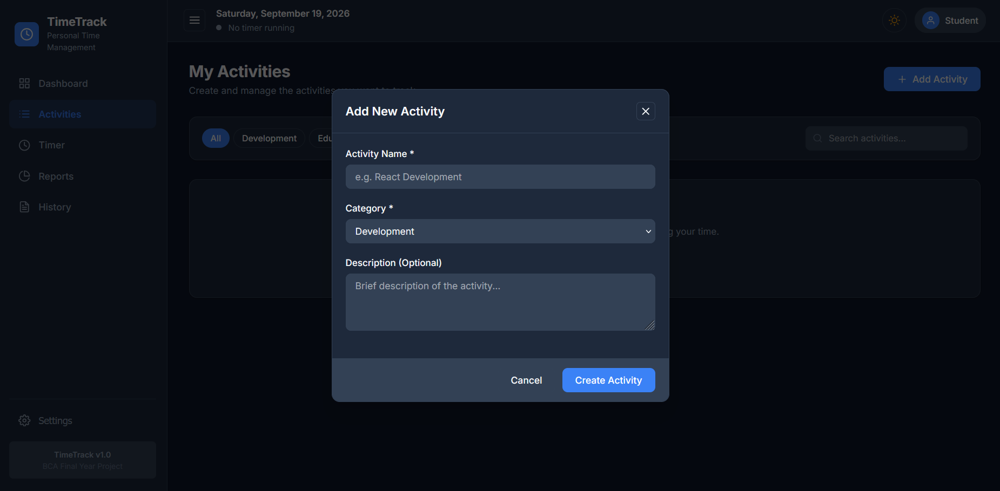
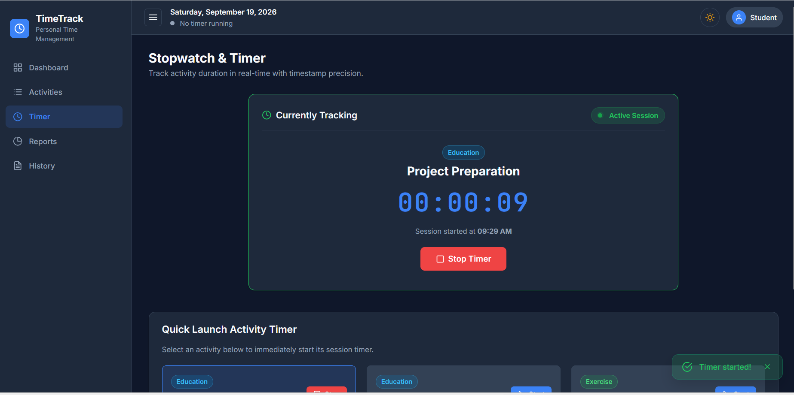
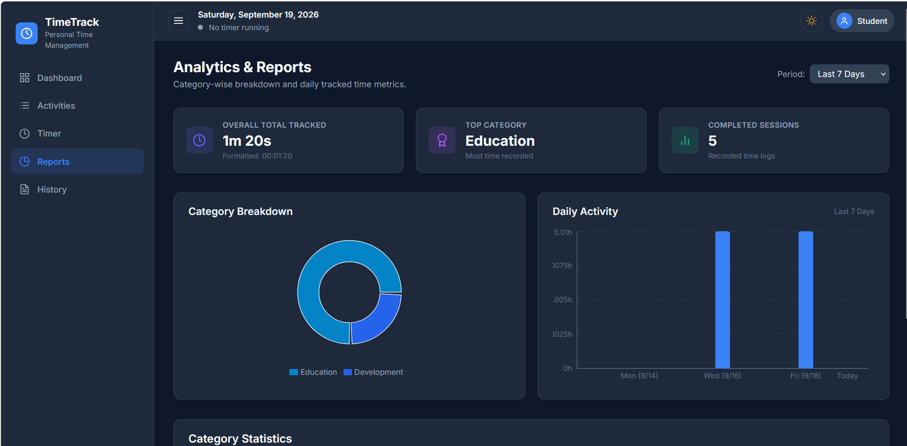
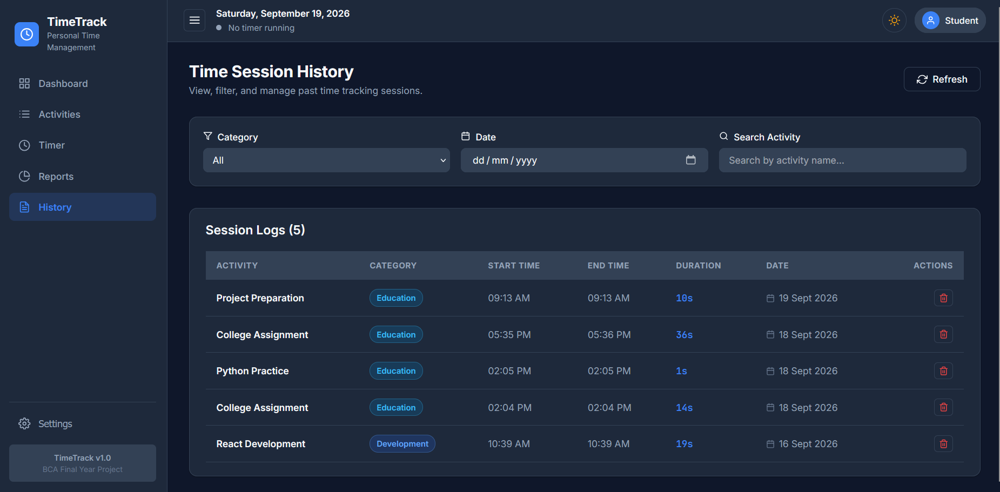

# TIME TRACKING TOOL
> A full-stack, modern SaaS-style web application for recording, monitoring, and analyzing activity durations.

---

## Table of Contents
1. [Project Overview & Problem Statement](#project-overview--problem-statement)
2. [Assigned Feature Set](#assigned-feature-set)
3. [Features Implemented](#features-implemented)
4. [Technologies Used](#technologies-used)
5. [Project Directory Structure](#project-directory-structure)
6. [Step-by-Step Installation & Setup](#step-by-step-installation--setup)
7. [API Endpoints Documentation](#api-endpoints-documentation)
8. [AI Tools Used & Representative Prompts](#ai-tools-used--representative-prompts)
9. [Testing Strategy & Edge Case Verification](#testing-strategy--edge-case-verification)
10. [Application Screenshots](#application-screenshots)
11. [Future Enhancements](#future-enhancements)

---

## Project Overview & Problem Statement

Students, professionals, and developers often struggle to monitor how effectively they spend their daily time across multiple tasks. Traditional timers lack category-wise breakdown, persistence across page refreshes, and daily analytics.

The **Time Tracking Tool** is a functional full-stack web application designed to allow users to create activities, run timestamp-accurate timers, categorize sessions, calculate daily total tracked time, and analyze productivity using dynamic charts.

---

## Assigned Feature Set

This application fulfills all 5 mandatory core requirements specified in the project assignment:
1. **Add Activities**: Create and manage activities with categories and optional descriptions.
2. **Start and Stop Timer**: Real-time stopwatch using timestamp calculations (`currentTime - startTime`) with single-timer restriction.
3. **Category-wise Tracking**: Group tracked hours by category (Development, Education, Work, Personal, Meeting, Exercise, Other).
4. **Time Summary**: Live summary dashboard displaying today's total, total activities, completed sessions count, active running timer, and top category.
5. **Daily Total**: Automatic calculation of daily tracked time over recent days.

---

## Features Implemented

- **Activity Management (CRUD)**: Add, edit, and delete activities. Validate inputs and auto-update total time tracked.
- **Timestamp-Accurate Timer**: Calculates elapsed duration using system timestamps, preventing timer drift.
- **Single Active Timer Rule**: Only one timer can be active at a time. Trying to start a second timer prompts the user to stop the active timer first.
- **Persistence Across Page Refresh**: Active timer state is synchronized with MongoDB backend endpoints. Reloading or navigating between pages retains ongoing timer state.
- **Category Analytics (Recharts)**: Interactive Donut / Pie chart breaking down time per category.
- **Daily Totals Bar Chart (Recharts)**: Bar chart displaying tracked hours for each day over the past 7/14/30 days.
- **Session History & Filtering**: Filter session logs by Category, Date, or Activity Name with deletion capability.
- **SaaS Dark/Light Mode Theme**: Modern CSS variable design system with persistent light and dark themes.

---

## Technologies Used
### Frontend

- **React.js (v18)**: Component-based UI library

- **Vite**: Rapid frontend build tool & development server

- **JavaScript (JSX)**: Modern ECMAScript standard

- **React Router (v6)**: Client-side single page app routing


### Backend

- **Node.js**: Asynchronous JavaScript runtime environment

- **Express.js**: REST API web framework


### Database

- **MongoDB**: NoSQL database for document storage

- **Mongoose**: Object Data Modeling (ODM) library
---
---

## Project Directory Structure

Time Tracking Tool/
│
├── client/
│   ├── package.json
│   ├── src/
│   └── ...
│
├── server/
│   ├── package.json
│   ├── server.js
│   └── ...
│
└── README.md
The project is divided into two main parts:

client - React/Vite frontend

server - Node.js/Express backend
```

---

## Step-by-Step Installation & Setup

### Prerequisites
- Node.js (v16.0 or higher) installed
- MongoDB installed locally OR MongoDB Atlas URI (Note: The server includes an automatic `mongodb-memory-server` fallback for offline testing).

### Step 1: Install Backend Dependencies
```bash
cd server
npm install
```

### Step 2: Configure Environment Variables
Create or verify the `.env` file in the `server/` directory:
```env
PORT=5000
MONGO_URI=mongodb://127.0.0.1:27017/time_tracking_db
NODE_ENV=development
```

### Step 3: Install Frontend Dependencies
Open a new terminal tab and navigate to `client/`:
```bash
cd client
npm install
```

### Step 4: Run the Application

1. **Start Backend Server**:
   ```bash
   cd server
   npm run dev
   # Server runs on http://localhost:5000
   ```

2. **Start Frontend Client**:
   ```bash
   cd client
   npm run dev
   # Vite App runs on http://localhost:3000
   ```

3. Open your browser and navigate to `http://localhost:3000`.

---

## API Endpoints Documentation

### 1. Activities (`/api/activities`)
| Method | Endpoint | Description |
| :--- | :--- | :--- |
| `GET` | `/api/activities` | Get all activities |
| `POST` | `/api/activities` | Create a new activity |
| `GET` | `/api/activities/:id` | Get activity by ID with linked sessions |
| `PUT` | `/api/activities/:id` | Update activity name, category, description |
| `DELETE` | `/api/activities/:id` | Delete activity and linked sessions |

### 2. Sessions & Timer (`/api/sessions`)
| Method | Endpoint | Description |
| :--- | :--- | :--- |
| `POST` | `/api/sessions/start` | Start timer for an activity |
| `POST` | `/api/sessions/stop` | Stop running timer & record duration |
| `GET` | `/api/sessions/active` | Get currently running timer session |
| `GET` | `/api/sessions` | Get session history (supports `?category=` & `?date=`) |
| `DELETE` | `/api/sessions/:id` | Delete session and deduct duration from activity |

### 3. Reports & Analytics (`/api/reports`)
| Method | Endpoint | Description |
| :--- | :--- | :--- |
| `GET` | `/api/reports/summary` | Today's total, overall total, activities & session count |
| `GET` | `/api/reports/category` | Category-wise duration & percentage aggregation |
| `GET` | `/api/reports/daily` | Daily total tracked hours for recent days |

---

## AI Tools Used & Representative Prompts

### AI Tools Utilized

- The following AI tools were used as learning and development assistants:

ChatGPT

AI assistance was used for:

Understanding the problem statement

Understanding programming concepts

Project planning

Writing and improving code

Debugging errors

Understanding npm and project setup

Debugging frontend/backend communication

MongoDB setup guidance

Testing and troubleshooting

Documentation and README preparation

AI-generated or AI-suggested code was reviewed, tested, and adapted as required.

 Important AI Prompts / AI Usage
Examples of prompts used during development include:

Project Development
Create a time tracking web application with a frontend and backend, including activities, timers, sessions, and reports.

Debugging
Help me identify and fix the error in my project and explain the steps clearly.

MongoDB Setup
Guide me step-by-step through installing and configuring MongoDB on Windows for my Node.js project.

Frontend/Backend Connection
Help me troubleshoot the Vite proxy connection between my React frontend and Node.js backend.

API Testing
Help me test the REST API endpoints and understand the response returned by the server.

Documentation
Create a README.md for my Time Tracking Tool according to the assignment requirements.

AI was used as an assistant. The generated suggestions were reviewed and tested during development rather than being submitted without verification

## Testing Strategy & Edge Case Verification

1. **Activity CRUD Testing**:
   - Added activities with valid & empty inputs.
   - Edited activity names and categories.
   - Deleted activities and confirmed cascading session deletion.
2. **Timer Accuracy & Refresh Test**:
   - Started a timer on "React Development".
   - Refreshed browser tab after 30 seconds -> Timer restored active session seamlessly without losing time.
   - Stopped timer -> Verified session saved to MongoDB and total tracked time updated on activity card.
3. **Single Timer Restriction Test**:
   - Attempted starting a second timer while one was running -> Backend returned 400 error message preventing duplicate running timers.
4. **Category & Daily Charts**:
   - Logged multiple sessions across different categories & days -> Verified Recharts Pie and Bar charts dynamically re-rendered database data.
5. **Responsive & Theme Verification**:
   - Tested light and dark theme toggle.
   - Tested UI layout on mobile, tablet, and desktop breakpoints.

---

## Application Screenshots

### 1. Dashboard Overview



### 2. Activity Management



### 3. Real-Time Active Timer



### 4. Category-Wise Analytics (Recharts)


### 5. Daily Total Tracking


### 6. Time Session History



---

## Future Enhancements
- User Authentication (JWT + Bcrypt registration & login)
- Export session logs to CSV / PDF
- Weekly & monthly goal tracking with notifications
- Project & Tag tagging for granular task tracking

---


